**paso 1**

¿Cuál es el DNS\_Name del balanceador de carga?

una vez que se levantó apache2 en la Práctica calificada Nº3 procedemos con la PC4

***"DNSName": "gilmaroviedo-334842788.us-east-1.elb.amazonaws.com"***

2\.-El comando describe-load-balancers describe el estado y las propiedades de tu(s) balanceador(es) de carga

**¿Cuál es la salida? al ejecutar el comando se obtiene la siguiente salida donde visualiza las ID de las instancias**

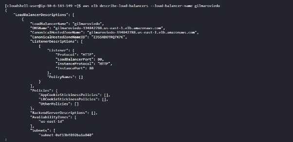

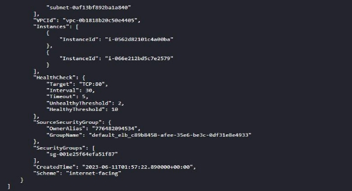

**3 Creamos dos instancias EC2, cada una ejecutando un servidor web Apache. Emite lo siguiente.**

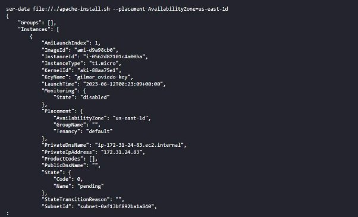

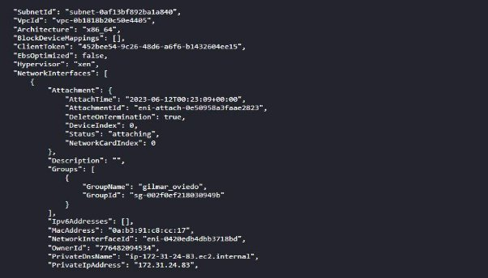

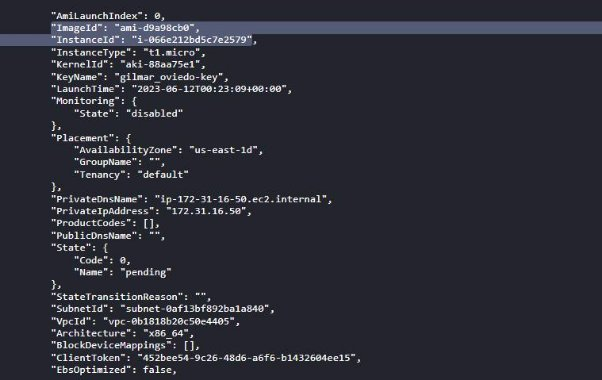

**¿Qué parte de este comando indica que deseas dos instancias EC2? El parámetro --count 2 indica que desea dos instancias EC2**

**¿Qué parte de este comando garantiza que tus instancias tendrán Apache instalado? El parámetro --user-data file://./apache-install garantiza que mis instancias tendrán Apache instalado**

**¿Cuál es el ID de instancia de la primera instancia?**

**"ImageId": "ami-d9a98cb0",**

**"InstanceId": "i-0562d82101c4a00ba"**

**¿Cuál es el ID de instancia de la segunda instancia?** "ImageId": "ami-d9a98cb0",

4 Para usar ELB, tenemos que registrar las instancias EC2. Haz lo siguiente, donde instance1\_id e instance2\_id son los obtenidos del comando en el paso 3.

¿Cuál es la salida? Ahora vea el estado de la instancia de los servidores cuya carga se equilibra.

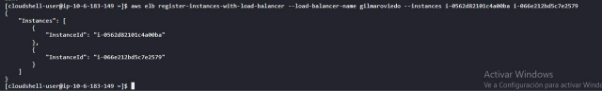

5 Abre el navegador del sandox. Recupera la dirección IP de tu balanceador de carga del paso 1, ingresa la URL http://nombre\_dns\_de\_tu\_balanceador\_carga/ en tu navegador web

¿Qué apareció en el navegador?

\6) Abre dos ventanas de terminal adicionales y ssh en ambos servidores web\. En cada uno, cd al directorio DocumentRoot (probablemente /usr/local/apache/htdocs) y modifique la página de inicio predeterminada, index\.html, de la siguiente manera\. accede a tu balanceador de carga 4 veces (actualícelo/recárgalo 4 veces)

Esto genera 4 solicitudes a tu balanceador de carga. ¿Cuántas solicitudes atendió el servidor web 1? se atendió a dos servidores web 1

¿Cuántas solicitudes atendió el servidor web 2? se atendió a dos servidores web 2

Parte 2: CloudWatch

7. CloudWatch se utiliza para monitorear instancias. En este caso, queremos monitorear los dos servidores web. Inicia CloudWatch de la siguiente manera.

¿Cuál es la salida?

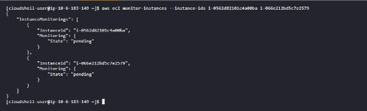

Ahora examina las métricas disponibles con lo siguiente ¿Viste la métrica CPUUtilization en el resultado? si

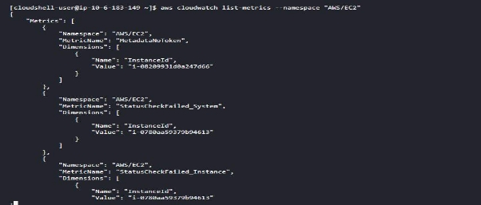

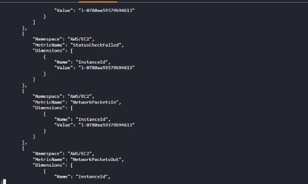

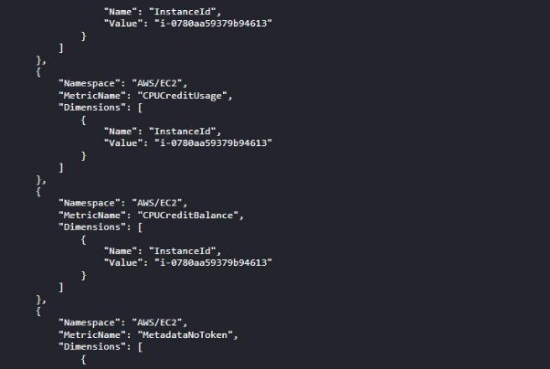

8. Ahora configuramos una métrica para recopilar la utilización de la CPU. Obtener la hora actual con date -u. Esta será tu hora de inicio. Tu hora de finalización debe ser 30 minutos más tarde: ¿Cuál es la salida?

9. Apache tiene un herramienta benchmark llamada ab. Si desea ver más información sobre ab, consulte <http://httpd.apache.org/docs/2.0/programs/ab.html>.

¿Qué significan -n 50 y -c 5? indican que se realizarán 50 solicitudes en total

¿Cuál es la salida?.

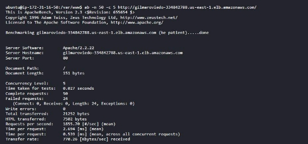

10. Ahora queremos examinar la métrica de latencia del ELB. Utiliza el siguiente comando con las mismas horas de inicio y finalización que especificó en el paso 8.

¿Qué resultados recibió de ambos comandos?

Parte 3: Limpieza

11. Necesitamos cancelar el registro de las instancias de ELB. ¿Cuál es la salida?

12\.A continuación, eliminamos la instancia de ELB de la siguiente manera

Finalmente, finaliza las instancias del servidor web de tus instancias y tu instancia EC2.

|¿Qué comandos usaste|?aws elb delete-load-balancer --load-balancer-name gilmarovied||
| - | - | :- |
|¿Cuál es la salida|?||
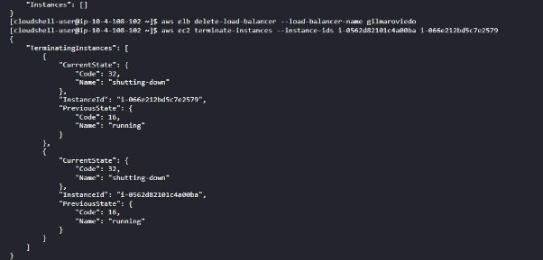

Auto Scaling

Parte 1: escalar hacia arriba

¿Cuál es la salida? A continuación, crea un equilibrador de carga.

2. Ahora creamos un grupo de escalado automático. ¿Cuál es la salida?

3. Para describir el grupo de escalado automático que acabas de crear, emite el siguiente comando

¿Cuál es la salida?

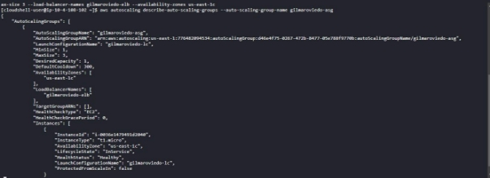

Deberías ver que se crea una nueva instancia EC2. Si no lo ves, espera 2 minutos y vuelve a ejecutar el comando.

¿Cuál es el ID de la instancia? "**InstanceId": "i-0036e1479491d2040**

4. **Ahora creamos una política de escalado hacía arriba seguida de una alarma de CloudWatch para determinar, en caso de que la política sea cierta, que AWS necesita**

**¿Cuál es la salida de ambos comandos?**

**¿Cuál es el valor de PolicyARN? "PolicyARN": "arn:aws:autoscaling:us-east-1:776482094534:scalingPolicy:e3b6be06-1c06-4cf0-bafd-0fd21b0442bf:autoScalingGroupName/gilmarovi edo-asg:policyName/gilmaroviedo-scaleup"**

**Descripción de la alarma ¿Cuál es la salida?**

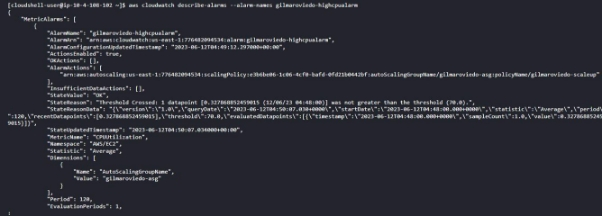

**"Name": "AutoScalingGroupName",**

**"Value": "gilmaroviedo-asg"**

5. **Inicia sesión en la instancia EC2 desde el paso 1 mediante ssh. Cambia al root. Cargaremos y ejecutaremos una herramienta stress para aumentar la utilización de procesamiento del servidor**

**inicializar instancia ec2 ¿Cuál es la salida?**

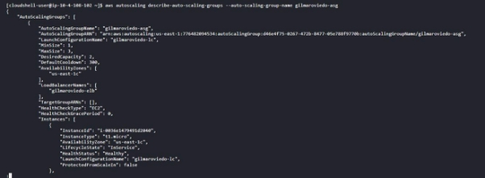

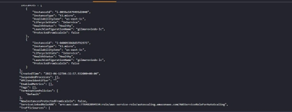

**"InstanceId": "i-0036e1479491d2040" 1 "InstanceId": "i-0d0093868d5f92975", 2**

**Parte 2: reducir la escala**

6. **Ahora exploraremos cómo AWS puede controlar el escalado hacia abajo mediante la eliminación de algunas de las máquinas virtuales creadas**

**¿Cuáles son las salidas?**

**¿Cuál es el valor de PolicyARN? arn:aws:autoscaling:us-east-1:776482094534:scalingPolicy:bfa52bf3-af49-47fa-aab1-f2a6c7e3b299:autoScalingGroupN ame/gilmaroviedo-asg:policyName/gilmaroviedo-scaledow**

**7 Cambia al terminal de la instancia EC2. Escribe ctrl+c para detener el comando stress. Vuelva a la ventana del terminal y repite el siguiente comando cada 2 minutos hasta que vea solo un EC2 en su grupo de escalado automático ¿Cuál es la salida?**

**aparece sola una instancia**

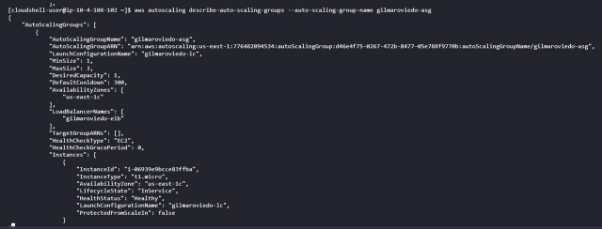

**Parte 3: Limpieza:**

**8 Elimina el grupo de escalado automático mediante el siguiente comando. Si el grupo tiene instancias o actividades de escalado en curso, debes especificar la opción para forzar la eliminación para que se realice correctamente. Si el grupo tiene políticas, al eliminar el grupo se eliminan las políticas, las acciones de alarma subyacentes y cualquier alarma que ya no tenga una acción asociada. Después de eliminar tu grupo de escala, elimina tus alarmas como se muestra a continuación.**

**Cuál es la salida?**

**¿Cuál es la salida?**

**Finalmente, elimina tu ELB.**

**¿Qué comando ejecutaste?.**

**aws elb delete-load-balancer --load-balancer-name gilmaroviedo-elb**

